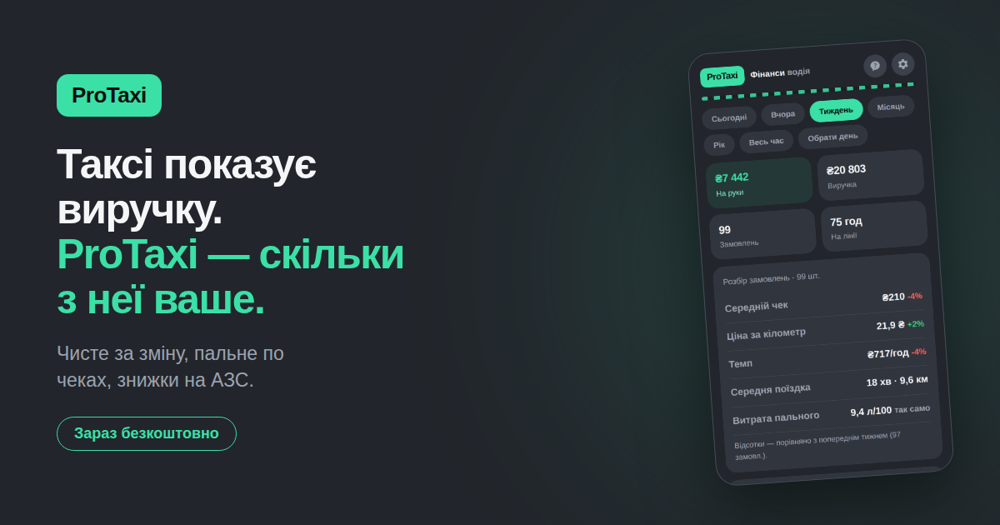

# ProTaxi

**Таксі показує виручку. ProTaxi показує, скільки з неї справді ваше.**

Застосунок для водія таксі. Рахує кожну зміну до кінця — і лишає одну чесну
цифру: на руки.

## Що вміє

- **Чисте за зміну, а не виручку.** Комісія платформи, еквайринг, пальне,
  оренда авто, запас на ремонт — усе враховано.
- **Оцінку кожного замовлення.** Видно, де ви заробили, а де просто покатались.
- **Пальне за фактом.** Витрата від бака до бака за вашими ж чеками, а не
  за паспортом авто.
- **Ціль дня.** Скільки ще замовлень і скільки часу — за вашою статистикою.
- **Запас на ремонт.** Частина кожної зміни лежить окремо, щоб поломка
  не була катастрофою.

## Відкрити

Працює прямо в Telegram, встановлювати нічого не треба:

**→ [t.me/ProTaxiApp_Bot](https://t.me/ProTaxiApp_Bot/app)**

Зараз триває відкрите тестування — безкоштовно.

## Приватність

Записи зберігаються на телефоні водія та в його Telegram-акаунті.
Ніхто не бачить сум і маршрутів — це конфіденційна інформація водія.

---

© ProTaxi. Усі права застережено.
